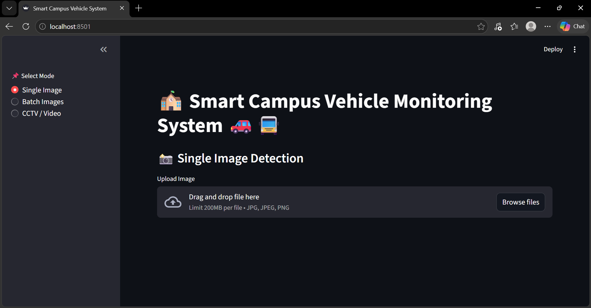
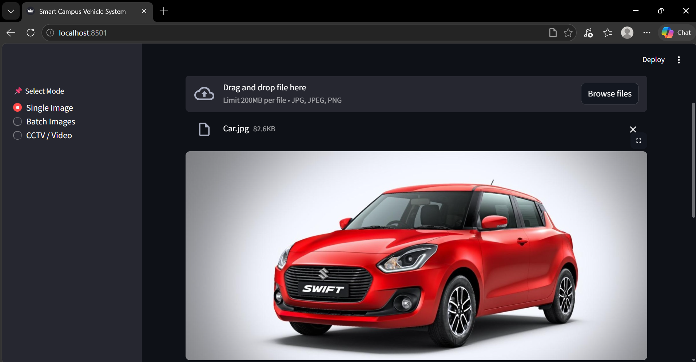
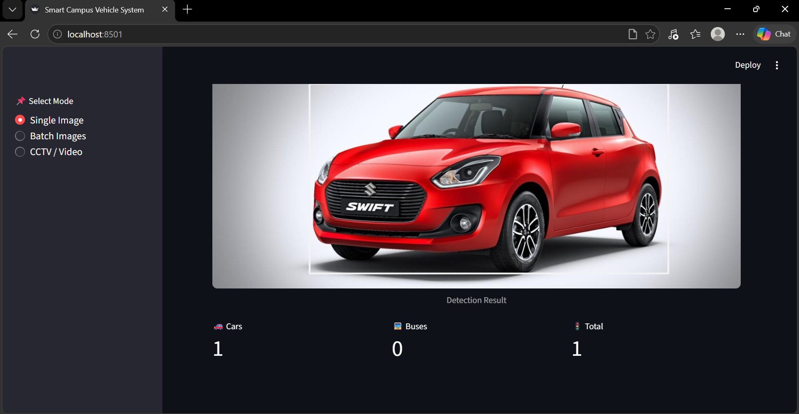
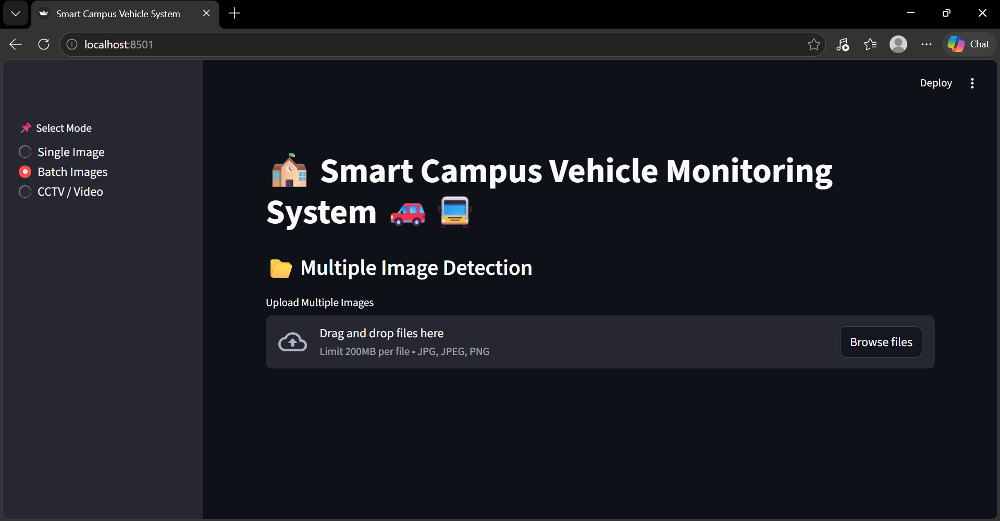
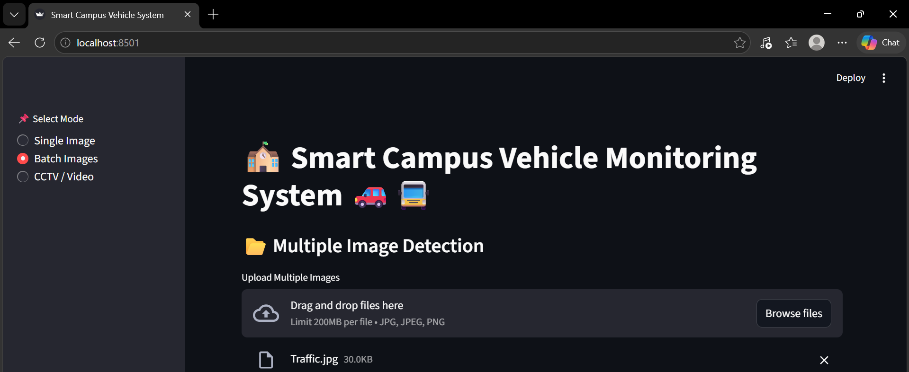
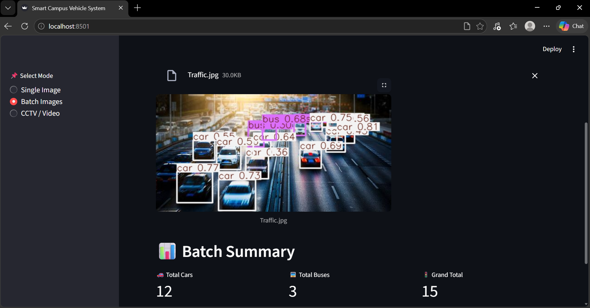
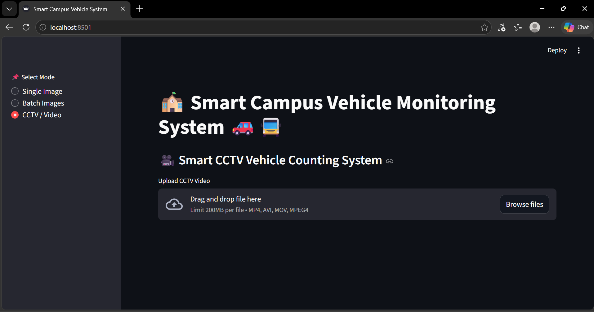
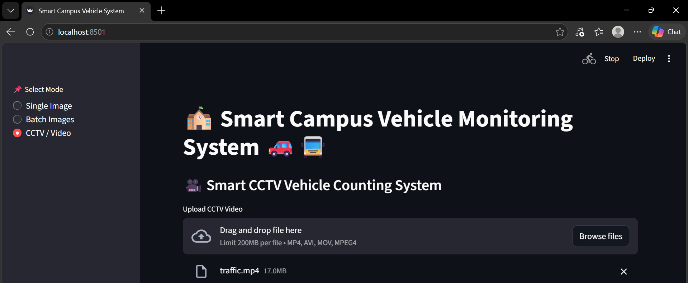

# Smart Campus Vehicle Monitoring System

## Project Overview

The Smart Campus Vehicle Monitoring System is a Deep Learning and YOLO-based Computer Vision application developed to detect, classify, track, and count vehicles such as cars and college buses within a campus environment. The system is capable of processing single images, multiple images, CCTV footage, and uploaded videos in real time using advanced object detection and tracking techniques.

This project combines Transfer Learning using MobileNetV2 and real-time object detection using YOLOv8 to create an intelligent vehicle monitoring platform. The application is deployed through Streamlit, providing an interactive and user-friendly web interface for vehicle detection and monitoring.

---

# Objectives

The primary objective of this project is to build a smart vehicle monitoring system that can:

* Detect vehicles from images and videos
* Classify vehicles as cars or college buses
* Count total vehicles automatically
* Monitor CCTV footage in real time
* Track vehicles without duplicate counting
* Provide live visualization using Streamlit

---

# Technologies Used

* Python
* TensorFlow
* MobileNetV2
* YOLOv8
* OpenCV
* Streamlit
* NumPy
* Pillow
* Ultralytics YOLO Framework

---

# Deep Learning Model

The project uses MobileNetV2, a pretrained Convolutional Neural Network trained on the ImageNet dataset. Transfer Learning is used to improve accuracy while reducing training time and computational requirements.

The model architecture includes:

* Data Augmentation Layer
* MobileNetV2 Feature Extractor
* GlobalAveragePooling2D Layer
* Dense Layer with ReLU Activation
* Dropout Layer
* Sigmoid Output Layer

The sigmoid activation function is used for binary classification between:

* Car
* College Bus

---

# YOLOv8 Object Detection

YOLOv8 is used for real-time object detection and vehicle tracking. The model detects multiple vehicles simultaneously and generates bounding boxes around detected objects.

The YOLO module in this project supports:

* Real-time object detection
* Vehicle counting
* CCTV monitoring
* Video processing
* Object tracking
* Duplicate count prevention

The project uses the pretrained YOLOv8 Nano model (`yolov8n.pt`) for faster inference and real-time performance.

---

# Dataset

The dataset used in this project contains two vehicle categories:

* Cars
* College Buses

The dataset is manually separated into:

* Training Dataset
* Testing Dataset

## Folder Structure

```bash id="0frn3p"
Dataset/

├── Train/
│   ├── bus/
│   └── car/
│
└── Test/
    ├── bus/
    └── car/
```

---

# Features

## Single Image Detection

The system allows users to upload a single image and perform vehicle detection. The application detects cars and buses, draws bounding boxes, and displays the vehicle count.

## Batch Image Detection

Users can upload multiple images simultaneously. The system processes all uploaded images and generates cumulative vehicle counts.

## CCTV / Video Detection

The project supports CCTV footage and uploaded videos. YOLOv8 tracking is used to monitor moving vehicles in real time while avoiding duplicate counting using unique track IDs.

---

# requirements.txt

```bash id="wo2xna"
streamlit
ultralytics
opencv-python-headless
tensorflow
numpy
pillow
torch
torchvision
```

---

# Concepts Used

This project implements several important Artificial Intelligence and Computer Vision concepts, including:

* Deep Learning
* Convolutional Neural Networks (CNN)
* Transfer Learning
* MobileNetV2
* Binary Classification
* Object Detection
* YOLOv8
* Computer Vision
* Image Processing
* Real-Time Tracking

---

# Future Enhancements

* License Plate Recognition
* Real-Time Webcam Monitoring
* Parking Management System
* Traffic Density Analysis
* Vehicle Speed Detection
* Database Integration
* Cloud-Based Monitoring
* AI Analytics Dashboard

---

# Application Output

# Single Image Detection

### Step 1: Upload Vehicle Image

Upload a single image containing cars or college buses for vehicle detection.



### Step 2: AI Vehicle Detection

The YOLOv8 model processes the uploaded image and detects vehicles using Deep Learning and Computer Vision techniques.



### Step 3: Detection Result and Vehicle Count

The system displays detected vehicles with bounding boxes and shows the total count of cars and buses.



---

# Batch Image Detection

### Step 1: Upload Multiple Images

Upload multiple vehicle images simultaneously for batch processing.



### Step 2: Batch Vehicle Processing

The system processes all uploaded images and detects vehicles in each image using YOLOv8.



### Step 3: Total Vehicle Count Summary

The application generates the cumulative count of cars and buses from all uploaded images.



---

# CCTV / Video Detection

### Step 1: Upload CCTV / Video File

Upload CCTV footage or vehicle monitoring video for real-time analysis.



### Step 2: Real-Time Vehicle Tracking

YOLOv8 tracking detects and tracks moving vehicles while preventing duplicate counting using unique tracking IDs.



### Step 3: Final Vehicle Monitoring Result

